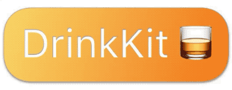

<p align="center"/>
    
</p>
<p align="center">
    
    <a href="https://github.com/Carthage/Carthage">
        
    </a>
    
    <a href="https://twitter.com/nehayward">
        
    </a>
</p>

Welcome to **DrinkKit**! DrinkKit is a small framework written in Swift which can easily calculate your Blood Alcohol Content or check how long until you're sober. Cheers!

## 👨‍💻 Quick Start

Download the [latest release](https://github.com/nehayward/DrinkKit/releases/latest) and open up the playground workspace. Then build iOS target.

```swift
import Foundation
import DrinkKit

// Create User
let john = User(sex: .male)

let BAC = BloodAlcoholContent(user: john)

// Set Started Drinking Time
let thirtyMinsAgo = Calendar.current.date(byAdding: .minute, value: -30, to: Date())!
let drinks : [Drink] = [Drink(alcohol: .wine)]

let currentBAC = BAC.get(with: drinks, started: thirtyMinsAgo)

print(currentBAC.percantage)
print(drinks)
```

## Usage

🥃 **Calculate your Blood Alcohol Content**

> `import DrinkKit` is required.

```swift
let oneHourAgo = Calendar.current.date(byAdding: .hour, value: -1, to: Date())!
let drinks : [Drink] = [Drink(Alcohol: .beer)]

let janice = User(sex: .female, weight: 120, feet: 5, inches: 2)
let BAC = BloodAlcoholContent(user: janice)

let currentBAC = BAC.Get(with: drinks, started: thirtyMinsAgo)
print(currentBAC)
```


⏱ **See When you'll be Sober**
> `import DrinkKit` is required.

```swift
let john = User(sex: .male)
let BAC = BloodAlcoholContent(user: john)

let soberAt = BAC.time(when: .sober, current: 0.08)
print(soberAt)
```

## Installation

You can download the latest frameworks from the [release section](https://github.com/nehayward/drinkkit/releases) or use [Carthage](https://github.com/Carthage/Carthage#installing-carthage). Please follow their instructions for downloading.

## Please enjoy **DrinkKit**, Prost!

This is my first open source project, I hope you enjoy it and I would appreciate any feedback. Let me know what you think on [Twitter](https://twitter.com/nehayward) 😊
